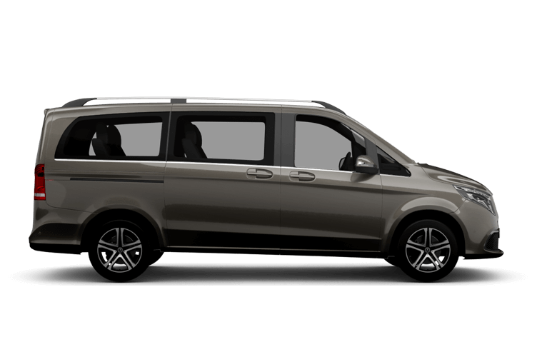

# 瑞士租車車款比較報告

## 租車需求
- **人數**: 6人 + 行李
- **租車地點**: 蘇黎世機場 (Zurich Kloten Airport)
- **租車日期**: 2026年6月13日 15:00 - 2026年6月24日 10:00
- **租車天數**: 11天

---

## SIXT 搜尋結果

### 1. Mercedes-Benz Vito Tourer ⭐ 推薦

| 項目 | 規格 |
|------|------|
| 座位數 | 9人座 |
| 行李容量 | 6件大型行李 |
| 車型等級 | Minivan |
| **每日租金** | **USD $197.51/天** |
| **11天總價** | **USD $2,172.58** |
| **換算台幣** | **約 TWD 68,840** (匯率1:31.7) |

**優點**:
- 9人座空間寬敞，6人乘坐非常舒適
- 行李空間充足，可放6件大型行李
- 價格較V-Class便宜

### 2. Mercedes-Benz V-Class Long

| 項目 | 規格 |
|------|------|
| 座位數 | 7人座 |
| 行李容量 | 6件大型行李 |
| 車型等級 | Premium Minivan |
| **每日租金** | **USD $230.84/天** |
| **11天總價** | **USD $2,539.22** |
| **換算台幣** | **約 TWD 80,493** (匯率1:31.7) |

**優點**:
- V-Class是豪華車型，內裝更高級
- 長軸版本空間充裕

**缺點**:
- 7人座對6人來說空間較緊湊
- 價格比Vito Tourer貴約17%

---

## Europcar 搜尋結果

**無可用車輛** - Europcar在蘇黎世機場於指定日期沒有提供Vans & Trucks類型車輛。

---

## 租車建議

### 推薦選擇: SIXT Mercedes-Benz Vito Tourer

**理由**:
1. **座位數最佳**: 9人座讓6位乘客有充足空間，長途行駛更舒適
2. **行李空間足夠**: 6件大型行李的容量，適合國際旅客
3. **價格最優**: 11天總價約 TWD 68,840，比V-Class便宜約 TWD 11,600
4. **實用性高**: Vito Tourer是經典商務/旅遊用車，可靠度高

### 價格比較總覽

| 車款 | 座位 | 行李 | 11天總價 (USD) | 11天總價 (TWD) |
|------|------|------|----------------|----------------|
| **Vito Tourer** | 9座 | 6件 | $2,172.58 | ~68,840 |
| V-Class Long | 7座 | 6件 | $2,539.22 | ~80,493 |

---

## 綜合成本試算

結合之前的分析報告 (六人交通成本比較分析.md)，採用**租車 + 半價卡 (Half Fare Card)** 方案：

| 項目 | 費用 (CHF) | 費用 (TWD) |
|------|------------|------------|
| 租車費用 (Vito Tourer) | ~1,676 | 68,840 |
| 油費預估 | ~400 | 16,400 |
| 高速通行證 | ~40 | 1,640 |
| 停車費預估 | ~150 | 6,150 |
| Lötschberg火車隧道 | ~30 | 1,230 |
| Täsch停車+接駁 | ~110 | 4,510 |
| 半價卡 (6人) | 900 | 36,900 |
| 少女峰門票 (6人，半價) | 744 | 30,504 |
| Gornergrat門票 (6人，半價) | 300 | 12,300 |
| **總計** | **~4,350** | **~178,474** |

---

## 注意事項

1. **提早預訂**: 建議提前2-3個月預訂，旺季車輛可能缺貨
2. **保險選擇**: SIXT基本報價通常不含全險，建議加購CDW碰撞險和盜竊險
3. **駕照要求**: 需攜帶國際駕照和本國駕照正本
4. **瑞士高速公路通行證**: 需購買年度Vignette (約CHF 40)
5. **Zermatt無車城**: 策馬特禁止一般車輛進入，需停在Täsch再搭火車
6. **加油**: 瑞士油價約CHF 1.8-2.0/公升

---

## 預訂連結

- **SIXT**: https://www.sixt.com
  - 搜尋地點: Zurich Airport (Kloten)
  - 日期: 2026/06/13 15:00 - 2026/06/24 10:00
  - 篩選: 7+ seats

---

*報告產生日期: 2026年2月1日*
*匯率參考: 1 USD ≈ 31.7 TWD, 1 CHF ≈ 41 TWD*
